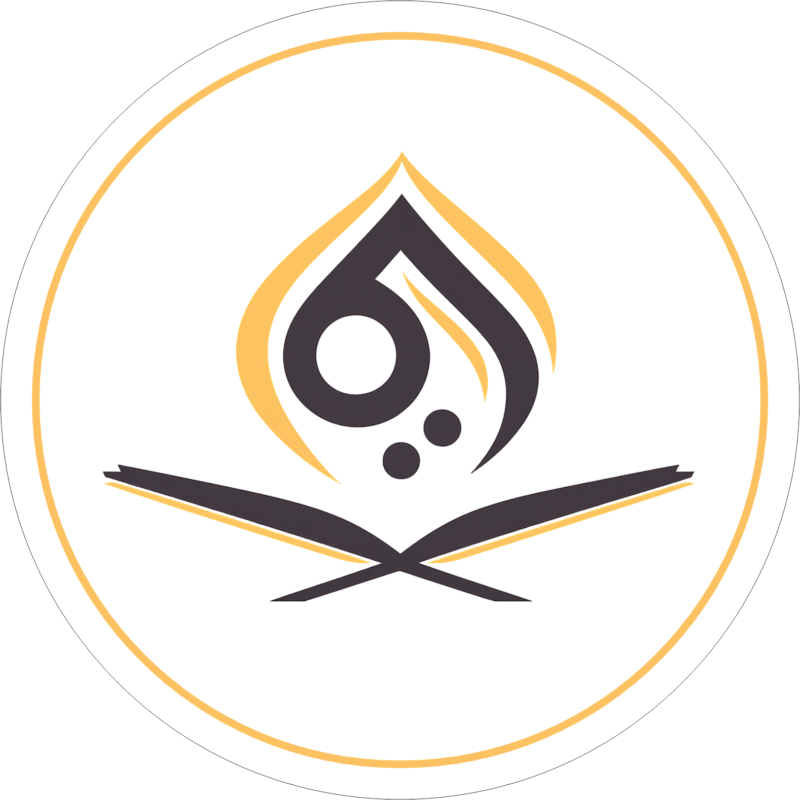

<!DOCTYPE html>
<html lang="id">
<head>
    <meta charset="UTF-8">
    <meta name="viewport" content="width=device-width, initial-scale=1.0">
    <title>Website Alqudwah - Tahap Pengembangan</title>
    <!-- Tailwind CSS CDN -->
    
    <!-- FontAwesome Icons -->
    <link href="https://cdnjs.cloudflare.com/ajax/libs/font-awesome/6.0.0/css/all.min.css" rel="stylesheet">
    <!-- Google Fonts Inter -->
    <link href="https://fonts.googleapis.com/css2?family=Inter:wght@400;500;600;700;800;900&display=swap" rel="stylesheet">
    <!-- Tag untuk memunculkan logo favicon -->
    <link rel="icon" type="image/png" href="logo.png">

    
    
</head>
<body class="bg-gray-100 min-h-screen font-sans">

    <!-- Overlay Pembangunan Alqudwah -->
    

        
        <!-- Animasi Background Blobs -->
        

            

            

            

        

        <!-- Main Card Popup (Diberi ID 'alqudwah-card' agar bisa diberi animasi keluar secara terpisah) -->
        

            
            <!-- Ikon Pembangunan -->
            

                                    </i>
</i>
            

            
            <!-- Badge Update -->
            

                
                    
                    
                
                Tahap Pengembangan
            

            <!-- Judul -->
            <h2 class="text-2xl md:text-[26px] font-black text-black mb-3 tracking-tight leading-tight">
                Website Alqudwah Sedang Dibangun
            </h2>

            <!-- Penjelasan -->
            

                Kami sedang merangkai dan menyempurnakan inovasi digital ini. Beberapa fitur mungkin belum maksimal, namun Anda tetap dapat menjelajahi halaman yang tersedia.
            

            <!-- Tombol Masuk -->
            <button onclick="closeAlqudwahOverlay()" class="w-full bg-brand-orange text-white px-7 py-3.5 rounded-full text-sm font-bold hover:bg-orange-500 hover:-translate-y-0.5 transition-all duration-300 shadow-[0_5px_15px_rgba(243,169,83,0.3)] flex items-center justify-center gap-2 group">
                Masuk ke Website
                <i class="fa-solid fa-arrow-right transform group-hover:translate-x-1 transition-transform"></i>
            </button>
        

    

<!-- Script Penutup Overlay Beranimasi & Perpindahan Halaman -->
    </body>
</html>
